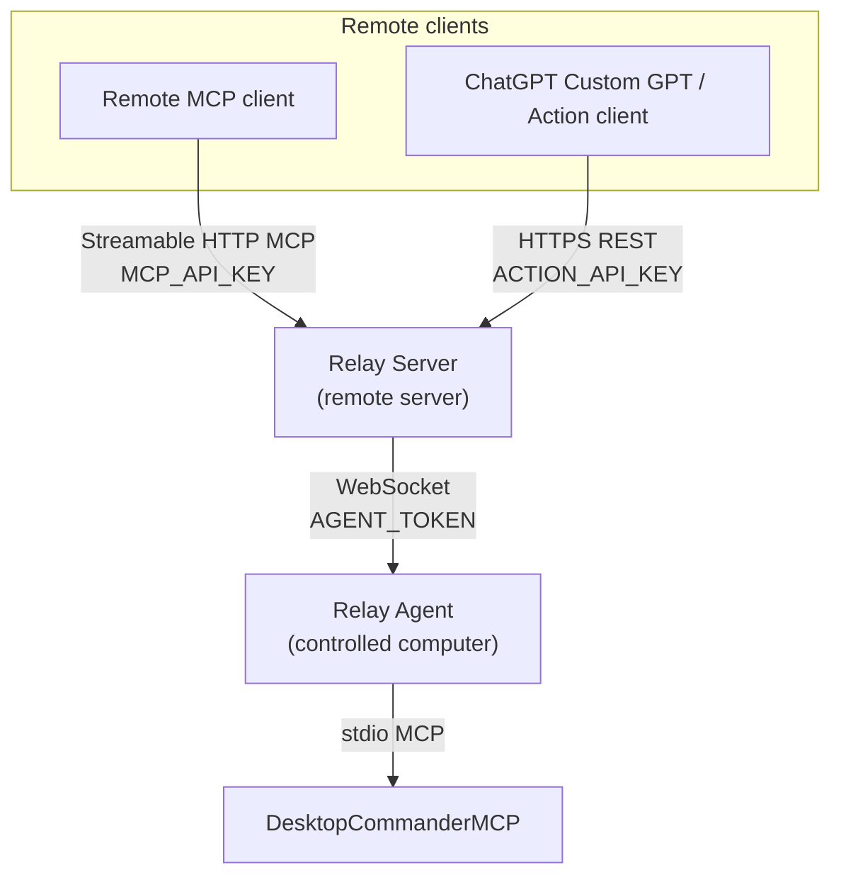

# DesktopCommanderRelay

DesktopCommanderRelay is a self-hosted bridge that exposes a local DesktopCommanderMCP process to remote MCP clients and, optionally, authenticated HTTP Action clients such as a ChatGPT Custom GPT. The Relay Server runs on a server, the Relay Agent runs on the computer that should be controlled, and the agent starts DesktopCommanderMCP over its normal stdio MCP transport.

This project is a separate relay. It does not emulate or clone the private upstream Desktop Commander remote service, and DesktopCommanderMCP does not need to be patched.

## Architecture

DesktopCommanderRelay supports two remote entry paths that share the same Relay Server and selected agent.



The MCP path and Action path have separate credentials and trust boundaries:

- `MCP_API_KEY` authenticates requests to the MCP endpoint.
- `ACTION_API_KEY` authenticates requests to the HTTP Action API.
- `AGENT_TOKEN` authenticates Relay Agents connecting over WebSocket.

The agent maintains the WebSocket connection to the server and forwards selected tool calls to the local DesktopCommanderMCP process.

## Quick Start

This is the canonical deployment path: Docker Compose for the Relay Server, and the built Node.js agent on the controlled computer. The server-side Compose file publishes Node only on `127.0.0.1:8787`; put a TLS reverse proxy in front of it.

The MCP endpoint can be used without enabling the ChatGPT Action API. The Action API is an additional authenticated interface to the same selected agent.

### 1. Prerequisites

On the server:

- Docker Engine with the Docker Compose plugin
- Node.js 20 or newer and npm to run the repository's secret generator
- A public DNS name such as `relay.example.com`
- A TLS reverse proxy terminating HTTPS/WSS

On the controlled computer:

- Node.js 20 or newer and npm
- DesktopCommanderMCP available as the `desktop-commander` command, as a built sibling checkout, or through an explicit entry path

The repository does not provision DNS or TLS certificates.

### 2. Install the Relay Server

Run these commands on the server. Replace `<repository-url>` with the repository URL you use; this project does not embed a canonical clone URL.

```bash
git clone <repository-url> DesktopCommanderRelay
cd DesktopCommanderRelay
cp .env.example .env
```

The Compose build installs the production dependencies and builds the server image. Host-side Node.js is only needed here for `npm run secrets`; the server image itself is built and run by Compose.

### 3. Generate and configure server credentials

Generate the independent MCP and agent credentials:

```text
npm run secrets
```

Copy the two output lines into `.env`. Keep the values different:

```env
MCP_API_KEY=<generated-mcp-api-key>
AGENT_TOKEN=<different-generated-agent-token>
```

If you also want to expose the ChatGPT-compatible Action API, generate a third independent secret. For example, on a system with OpenSSL:

```bash
openssl rand -hex 32
```

Add it to the server `.env`:

```env
ACTION_API_KEY=<different-generated-action-api-key>
```

Do not reuse `MCP_API_KEY`, `ACTION_API_KEY`, or `AGENT_TOKEN` for one another.

For a public hostname with both MCP and Actions enabled, a minimal server configuration is:

```env
MCP_API_KEY=<generated-mcp-api-key>
ACTION_API_KEY=<different-generated-action-api-key>
AGENT_TOKEN=<different-generated-agent-token>
TARGET_DEVICE_ID=home-pc
MCP_ALLOWED_HOSTS=relay.example.com
ALLOW_INSECURE_LOCAL=false
```

The Compose file overrides `HOST` to `0.0.0.0` inside the container and publishes the container port as `127.0.0.1:8787`. Keep `PORT=8787` unless you also change the Compose port mapping and reverse-proxy upstream. `MCP_ALLOWED_HOSTS` must contain the public hostname sent by the proxy, without a scheme or port.

### 4. Start the Relay Server

Run on the server:

```bash
docker compose up -d --build
docker compose logs -f relay
```

The server listens inside the container on port `8787`. The public MCP URL will normally be:

```text
https://relay.example.com/mcp
```

When enabled, the Action API base path will normally be:

```text
https://relay.example.com/action
```

The agent does not connect to either HTTP client endpoint; it uses the WebSocket URL shown in step 7.

### 5. Configure TLS and the reverse proxy

Provision the certificate separately, then use the routes in [`deploy/nginx.conf.example`](deploy/nginx.conf.example) inside the HTTPS server block for `relay.example.com`.

The proxy must forward:

- `POST /mcp` to `http://127.0.0.1:8787`, including `Host`, `Authorization`, `X-Forwarded-Proto`, and `X-Forwarded-For`.
- WebSocket upgrades for `/agent` to `http://127.0.0.1:8787`, including `Upgrade`, `Connection`, `Host`, `Authorization`, `X-Desktop-Commander-Device-Id`, `X-Forwarded-Proto`, and `X-Forwarded-For`.
- If the Action API is enabled, `/action` and `/action/*` to `http://127.0.0.1:8787`, preserving the `Authorization` header.

The current Nginx example documents the MCP and agent routes. If you enable Actions and use path-specific proxy locations, add an Action route to the same upstream.

Use HTTPS for the public MCP and Action URLs and WSS for the agent URL. The repository supplies proxy examples but does not issue certificates.

### 6. Verify the server

Run from a machine that can reach the public hostname:

```bash
curl -fsS https://relay.example.com/healthz
```

The endpoint is expected to return a successful health response containing the server status fields implemented by this project; before the agent starts, the connected device count should be `0`.

### 7. Build and start the Relay Agent on the controlled computer

Run these commands on the computer where DesktopCommanderMCP should run, not on the server:

```powershell
cd C:\path\to\DesktopCommanderRelay
npm ci
npm run build
$env:RELAY_WS_URL = "wss://relay.example.com/agent"
$env:AGENT_TOKEN = "<same-generated-agent-token-as-server>"
$env:DEVICE_ID = "home-pc"
npm run start:agent
```

`DEVICE_ID` is normalized to lowercase identifier characters. Set `TARGET_DEVICE_ID` on the server to the same normalized value when selecting this device.

The agent resolves DesktopCommanderMCP in this order:

1. `DESKTOP_COMMANDER_ENTRY`, when set; it is launched with the current Node executable.
2. A built sibling at `../DesktopCommanderMCP/dist/index.js` relative to the two sibling project directories.
3. `DESKTOP_COMMANDER_COMMAND`, defaulting to `desktop-commander`, with arguments from `DESKTOP_COMMANDER_ARGS_JSON`, defaulting to `[]`.

The default child environment is the MCP SDK safe environment subset plus `DC_REMOTE_DEVICE=true`. Additional names are passed only when listed in `DESKTOP_COMMANDER_ENV_ALLOWLIST` as a comma-separated allowlist. Do not put relay credentials in that allowlist unless forwarding them is intentional.

If the sibling build is not available and the command is not on `PATH`, set an explicit entry before starting the agent:

```powershell
$env:DESKTOP_COMMANDER_ENTRY = "C:\path\to\DesktopCommanderMCP\dist\index.js"
npm run start:agent
```

### 8. Verify the agent connection

Repeat the health check:

```bash
curl -fsS https://relay.example.com/healthz
```

`"devices"` should now be `1`. After connecting an MCP client, call the relay tool `relay_status`. It should report `connected_devices: 1` and `selected_device: "home-pc"` when `TARGET_DEVICE_ID=home-pc` is configured.

If the Action API is enabled, you can also inspect the selected device through the Action status endpoint:

```bash
curl -fsS \
  -H "Authorization: Bearer $ACTION_API_KEY" \
  https://relay.example.com/action/status
```

### 9. Connect Codex as an MCP client

Set the client-side environment variable without putting the secret in the Codex configuration.

PowerShell:

```powershell
$env:DESKTOP_COMMANDER_RELAY_API_KEY = "<same-generated-mcp-api-key-as-server>"
```

POSIX shell:

```bash
export DESKTOP_COMMANDER_RELAY_API_KEY='<same-generated-mcp-api-key-as-server>'
```

With that variable set, run the Codex CLI command shown below if your installed Codex CLI exposes the same MCP bearer-token option (verify with `codex mcp add --help`):

```text
codex mcp add desktop-commander-relay --url https://relay.example.com/mcp --bearer-token-env-var DESKTOP_COMMANDER_RELAY_API_KEY
```

The MCP client URL is `https://relay.example.com/mcp`; the agent URL is separately `wss://relay.example.com/agent`. Finally call `relay_status` or `relay_list_devices` from the connected MCP client to confirm the selected agent.

### 10. Connect a ChatGPT Custom GPT through Actions

The HTTP Action adapter is intended for clients that can call authenticated REST/OpenAPI operations rather than the MCP transport directly.

Configure the Action client to use Bearer authentication with `ACTION_API_KEY` and the public server URL, for example:

```text
https://relay.example.com
```

The Action API exposes these operations:

| Method | Path | Purpose |
| --- | --- | --- |
| `GET` | `/action/status` | Returns connected devices, the selected device, and any device-selection problem. |
| `GET` | `/action/tools` | Lists Action-visible DesktopCommander tools. |
| `GET` | `/action/tools?name=<tool>` | Returns the full definition of one Action-visible tool. |
| `POST` | `/action/tools/{name}/call` | Calls an allowed DesktopCommander tool on the selected agent. |

Tool calls use this request shape:

```json
{
  "arguments": {
    "path": "C:\\Users\\user\\Projects\\example.txt"
  }
}
```

The Action API uses the same server-side device-selection logic as the MCP path. `/action/status` can report multiple connected agents, but normal Action tool calls are still sent to the device selected by `TARGET_DEVICE_ID` or by the relay's single-device fallback behavior.

## ChatGPT Action tool policy

The Action interface intentionally hides and rejects a set of DesktopCommander tools that could bypass filesystem restrictions or change the local policy.

The following tools are currently blocked through `/action`:

```text
set_config_value
start_process
interact_with_process
read_process_output
force_terminate
kill_process
```

Blocked tools are removed from `/action/tools`. A direct attempt to call one returns HTTP `403` with an error indicating that the tool is not permitted through ChatGPT Actions.

This filtering applies only to the HTTP Action interface. It does not remove those tools from DesktopCommanderMCP itself and does not change what a separately authenticated MCP client may be able to access.

The current policy is a blocklist. If you need a strict file-only security boundary, consider replacing it with an explicit server-side allowlist so newly added upstream DesktopCommander tools are not exposed automatically.

## DesktopCommander filesystem restrictions

Filesystem restrictions are enforced by DesktopCommanderMCP on the controlled computer, not by the Relay Server's path parser.

DesktopCommanderMCP supports an `allowedDirectories` configuration. For example:

```json
{
  "allowedDirectories": [
    "C:\\Users\\user\\Projects",
    "C:\\Users\\user\\Documents\\AI-Work"
  ]
}
```

When configured, DesktopCommander filesystem tools such as `read_file`, `write_file`, `list_directory`, `move_file`, `get_file_info`, and `edit_block` reject filesystem paths outside those directories.

Important security notes:

- An empty `allowedDirectories` list may mean unrestricted filesystem access depending on the DesktopCommanderMCP configuration semantics. Verify the local configuration before exposing a remote client.
- The Action API blocks `set_config_value`, so a ChatGPT Action client cannot remove or expand `allowedDirectories` through the current Action adapter.
- The Action API also blocks terminal/process execution tools listed above so they cannot be used through Actions to trivially bypass a filesystem-only path restriction.
- These restrictions do not automatically constrain a separate direct/local DesktopCommander client that has broader tool access.
- Operating-system permissions are a stronger final boundary. For high-assurance deployments, run the agent/DesktopCommander process under a dedicated OS account with access only to the directories it actually needs.

## Requirements and commands

- Node.js `>=20.0.0` and npm are required for the native server/agent commands and for building the agent. The Docker image uses Node 22 Alpine.
- The installed MCP SDK packages are version `2.0.0` in the lockfile. The server configures the SDK's Streamable HTTP handler with legacy stateless mode.
- `npm ci` installs dependencies from the lockfile.
- `npm run build` compiles TypeScript to `dist/`.
- `npm run start:server` and `npm run start:agent` run the compiled processes.
- `npm run dev:server` and `npm run dev:agent` run the TypeScript entrypoints through `tsx` for development.
- `npm run typecheck` performs a no-emit TypeScript check.
- `npm test` runs the repository tests. `npm run check` runs build, typecheck, and tests; it is a developer verification command, not an installation prerequisite.
- `npm run secrets` prints one random `MCP_API_KEY` and one random `AGENT_TOKEN` without writing them to a file. Generate `ACTION_API_KEY` separately when enabling the Action API.

## Configuration

The server and agent should use separate environment files. Never commit real credentials.

### Server variables

| Variable | Required/default | Description |
| --- | --- | --- |
| `HOST` | `127.0.0.1` by default; Compose overrides it to `0.0.0.0` in the container | Server bind address. A public bind requires `MCP_ALLOWED_HOSTS`. |
| `PORT` | `8787` | HTTP listener port. |
| `MCP_PATH` | `/mcp` | MCP HTTP route. |
| `ACTION_PATH` | `/action` | Base path for the authenticated HTTP Action API. |
| `AGENT_WS_PATH` | `/agent` | Agent WebSocket route. |
| `MCP_API_KEY` | Required unless insecure loopback mode is enabled | Bearer token for MCP HTTP requests. |
| `ACTION_API_KEY` | Required when exposing the Action API publicly | Independent Bearer token for `/action/*`. Do not reuse `MCP_API_KEY` or `AGENT_TOKEN`. |
| `AGENT_TOKEN` | Required unless insecure loopback mode is enabled | Independent Bearer token for agent WebSocket connections. |
| `TARGET_DEVICE_ID` | Optional | Selects one connected device. With no target, one connected device is selected automatically. |
| `MCP_ALLOWED_HOSTS` | `localhost,127.0.0.1,[::1]` when unset; required for a public bind | Comma-separated hostnames, without scheme or port. |
| `MCP_ALLOWED_ORIGINS` | Defaults to the allowed hostnames | Optional comma-separated origins or hostnames. Matching uses hostname only; scheme and port are ignored. |
| `ALLOW_INSECURE_LOCAL` | `false` | Development-only bypass for credentials on a non-public bind. It is rejected for `0.0.0.0` and `::`. |
| `TOOL_CALL_TIMEOUT_MS` | `300000` | Server-side tool-call timeout. |
| `MAX_PENDING_CALLS_PER_DEVICE` | `64` | Maximum pending calls per selected device. |
| `WS_MAX_PAYLOAD_BYTES` | `33554432` | Maximum server WebSocket payload. |
| `HTTP_BODY_LIMIT` | `32mb` | Express JSON body limit. |
| `AGENT_HELLO_TIMEOUT_MS` | `10000` | Time allowed for the agent hello message. |
| `WS_HEARTBEAT_MS` | `20000` | WebSocket heartbeat interval. |

### Agent variables

| Variable | Required/default | Description |
| --- | --- | --- |
| `RELAY_WS_URL` | Required | WebSocket URL, normally `wss://relay.example.com/agent`. |
| `AGENT_TOKEN` | Required | Must equal the server's `AGENT_TOKEN`, not its `MCP_API_KEY` or `ACTION_API_KEY`. |
| `DEVICE_ID` | Hostname by default | Device identifier sent to the server. Use the same normalized value in `TARGET_DEVICE_ID`. |
| `DEVICE_NAME` | Hostname by default | Display name reported by the agent. |
| `DESKTOP_COMMANDER_ENTRY` | Optional | Explicit path to the DesktopCommanderMCP JavaScript entrypoint. Highest resolution priority. |
| `DESKTOP_COMMANDER_COMMAND` | `desktop-commander` | Fallback executable or command when no explicit/sibling entry is found. |
| `DESKTOP_COMMANDER_ARGS_JSON` | `[]` | JSON array of string arguments for the fallback command. |
| `DESKTOP_COMMANDER_ENV_ALLOWLIST` | Empty | Comma-separated names of extra environment variables to pass to the child. |
| `AGENT_MAX_CONCURRENCY` | `4` | Maximum local tool calls running at once. |
| `AGENT_MAX_QUEUE` | `100` | Maximum queued calls when all concurrency slots are busy. |
| `AGENT_RECONNECT_MIN_MS` / `AGENT_RECONNECT_MAX_MS` | `1000` / `30000` | Reconnect backoff bounds. |
| `AGENT_RESULT_CACHE_SIZE` | `100` | Number of completed call results retained for duplicate call IDs. |
| `AGENT_TOOL_REFRESH_MS` | `60000`; `0` disables refresh | How often the agent refreshes the local tool list. |
| `AGENT_WS_MAX_PAYLOAD_BYTES` | `33554432` | Maximum agent WebSocket payload. |

## Device selection

The server can track multiple connected agents, but normal DesktopCommanderMCP tool names are not namespaced by device.

- With exactly one connected agent and no `TARGET_DEVICE_ID`, that agent is selected.
- With multiple connected agents and no target, normal DesktopCommanderMCP tools are unavailable until `TARGET_DEVICE_ID` is set.
- If `TARGET_DEVICE_ID` is offline, normal DesktopCommanderMCP tools are unavailable until it reconnects.
- `relay_status` and `relay_list_devices` are always exposed by the MCP relay for status and device discovery.
- `/action/status` reports the connected devices and selected device to Action clients.
- The current Action call endpoint does not accept a per-request `device_id`; it uses the server-selected device.

## Security

Use HTTPS/WSS through a reverse proxy for public deployments. Do not expose the raw Node listener directly to the Internet.

Keep `MCP_API_KEY`, `ACTION_API_KEY`, and `AGENT_TOKEN` random, separate, and outside source control. They protect different interfaces and should not be reused.

Anyone with `MCP_API_KEY` can call tools exposed by the selected connected agent through the MCP interface, subject to DesktopCommanderMCP's own restrictions and the relay's MCP behavior.

Anyone with `ACTION_API_KEY` can use the tools exposed by `/action/tools`. The Action adapter currently applies its own server-side tool filter and rejects the blocked tools documented above. This Action-specific filter does not modify DesktopCommanderMCP itself.

Treat the Action API as a powerful remote-control interface even when process tools are blocked. Remaining tools may still read, create, modify, move, search, or inspect files inside locally permitted directories. Some DesktopCommander tools may also have non-filesystem behavior; review the visible tool list before granting an Action key to a client.

`allowedDirectories` is a DesktopCommanderMCP-side restriction. For stronger isolation, combine it with operating-system filesystem permissions and a dedicated service account on the controlled machine.

Host validation and agent WebSocket validation use `MCP_ALLOWED_HOSTS`. Origin validation is applied when a request includes an `Origin` header. Both checks compare hostnames; configured origin schemes and ports are not compared. Set `MCP_ALLOWED_ORIGINS` explicitly when browser-originated connections are expected.

The relay limits HTTP/WebSocket payloads, pending and queued work, and tool-call duration. It uses WebSocket heartbeats and avoids logging tool arguments and results in normal operation. `ALLOW_INSECURE_LOCAL=true` is for loopback development only.

For a private personal ChatGPT integration, keep the Custom GPT private and avoid sharing its Action credentials.

## Failure and retry semantics

Each forwarded tool call has one relay call ID. The agent retains a bounded result cache and does not execute a duplicate ID twice; an in-flight duplicate receives the existing result when available.

Queued calls for a disconnected WebSocket are discarded. A call that may already be running is not automatically replayed after a disconnect, because replaying a side-effecting command could execute it twice. The remote client receives a failure and must decide whether a retry is safe. Tool calls also fail when the server-side timeout or pending-call limit is reached.

The agent reconnects with bounded backoff and periodically refreshes the local tool list. A new or restarted DesktopCommanderMCP process can therefore change the tools advertised by the agent after the next refresh. Action-visible tools are derived from that tool list and then filtered by the Action tool policy.

## Deployment alternatives

### Docker Compose

`Dockerfile` builds a production server image with Node 22 Alpine and runs `dist/server/index.js` as the non-root `node` user. `docker-compose.yml` loads `.env`, sets the container bind to `0.0.0.0`, and publishes `127.0.0.1:8787:8787`.

### systemd

The example units [`deploy/desktop-commander-relay-server.service`](deploy/desktop-commander-relay-server.service) and [`deploy/desktop-commander-relay-agent.service`](deploy/desktop-commander-relay-agent.service) use these paths:

- Server: `/opt/DesktopCommanderRelay`, `/opt/DesktopCommanderRelay/.env`, and `/opt/DesktopCommanderRelay/dist/server/index.js`.
- Agent: `%h/DesktopCommanderRelay`, with environment file `%h/.config/desktop-commander-relay/agent.env`, and `%h/DesktopCommanderRelay/dist/agent/index.js`.

Copy the appropriate unit to `/etc/systemd/system/`, adjust paths and permissions for the service account, then reload and enable it:

```bash
sudo systemctl daemon-reload
sudo systemctl enable --now desktop-commander-relay-server.service
sudo systemctl status desktop-commander-relay-server.service
```

Use the analogous `desktop-commander-relay-agent.service` commands for the agent unit. The unit files do not provision Node.js, build the project, or create environment files.

### Nginx

[`deploy/nginx.conf.example`](deploy/nginx.conf.example) contains the MCP and agent proxy routes, forwarded headers, buffering settings, body-size limit, and timeouts used by the example. TLS termination belongs in the HTTPS server block, not in the Node process.

If the Action API is enabled, proxy `/action` and `/action/*` to the same `127.0.0.1:8787` upstream and preserve the Bearer `Authorization` header.

## Development

For local development, use separate environment values for the server and agent. The available development entrypoints are:

```bash
npm run dev:server
npm run dev:agent
```

For the full repository verification command, use:

```bash
npm run check
```

That command builds, typechecks, and runs the tests. It is not required by the production Quick Start.
